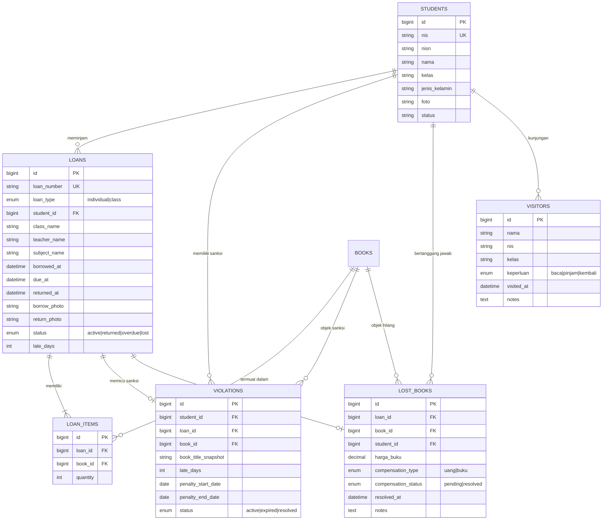

# DOKUMEN PERANCANGAN SISTEM PERPUSTAKAAN DIGITAL
## SMK NEGERI 1 CIANJUR (SMAKZIE LIBRARY ECOSYSTEM)
**Versi:** 2.0 (Realisasi Produksi)  
**Status:** Terealisasi Penuh & Live di Produksi  
**URL Produksi:**  
- Web App / Admin: [https://library.smkn1cianjur.sch.id](https://library.smkn1cianjur.sch.id)  
- Kiosk Mandiri: [https://library.smkn1cianjur.sch.id/kiosk](https://library.smkn1cianjur.sch.id/kiosk)  

---

## 1. Ringkasan Eksekutif & Latar Belakang

Sistem Perpustakaan Digital SMK Negeri 1 Cianjur dirancang untuk mengatasi inefisiensi sirkulasi konvensional, antrean panjang peminjaman buku pelajaran, serta ketidaksinkronan data antara sistem perpustakaan eksisting (SLiMS) dengan data induk sekolah.

Sistem ini merealisasikan **3 pilar utama**:
1. **Kiosk Self-Service Mandiri**: Siswa dapat melakukan peminjaman individu, peminjaman buku paket kelas, serta pengembalian mandiri secara cepat tanpa antre di meja petugas, dilengkapi verifikasi identitas real-time dan dokumentasi foto webcam.
2. **Dual-App & Multi-Database Synchronizer**: Menjembatani database platform sekolah (`smkzie_platform`), database perpustakaan transaksional (`smkzie_perpustakaan`), dan database perpustakaan nasional/SLiMS (`perpustakaan_slims`) tanpa merusak data lama.
3. **Backoffice Admin & Official Reporting**: Panel operasional pustakawan untuk manajemen buku hilang, pembebasan sanksi pelanggaran, cetak barcode label eksemplar, audit trail aktivitas, serta cetak laporan kunjungan format standar kedinasan F4 dengan kop surat resmi.

---

## 2. Arsitektur Sistem & Infrastruktur

### 2.1 Diagram Arsitektur Komponen

```
┌────────────────────────────────────────────────────────────────────────┐
│                          KLIEN & USER INTERFACE                        │
├───────────────────────────────────┬────────────────────────────────────┤
│         Kiosk Station (Front)     │        Admin & Staff Panel         │
│   • Layar Sentuh / Monitor Kiosk  • Dashboard Manajemen Sirkulasi     │
│   • Barcode Scanner Fisik         • Manajemen Sanksi & Buku Hilang    │
│   • Webcam Verifikasi Bukti Wajah │ • Cetak Laporan F4 & Barcode Label │
└─────────────────┬─────────────────┴──────────────────┬─────────────────┘
                  │                                    │
                  │ REST API (JSON / HTTPS)            │ Sanctum Bearer Token
                  ▼                                    ▼
┌────────────────────────────────────────────────────────────────────────┐
│                   BACKEND API ENGINE (Laravel 11 Modular)              │
├────────────────────────────────────────────────────────────────────────┤
│ • KioskController       • LoanController          • BookController     │
│ • StudentController     • ViolationController     • LostBookController │
│ • ReportController      • TeacherController       • AuditLogController │
│ • ViolationService      • BookLookupService       • AuditService       │
└─────────────────┬───────────────────┬───────────────────┬──────────────┘
                  │                   │                   │
                  ▼                   ▼                   ▼
┌─────────────────────────┐ ┌───────────────────┐ ┌──────────────────────┐
│  DB: smkzie_perpustakaan│ │DB: smkzie_platform│ │  DB: slims_smkn1cjr  │
│  • loans & loan_items   │ │• siswa (Dapodik)  │ │  • biblio            │
│  • violations           │ │• guru             │ │  • item (eksemplar)  │
│  • lost_books           │ │• mata_pelajaran   │ │  • mst_author        │
│  • visitors             │ │• guru_mapel       │ │  • mst_publisher     │
│  • audit_logs & settings│ │• rombel           │ │  • mst_category      │
└─────────────────────────┘ └───────────────────┘ └──────────────────────┘
```

### 2.2 Spesifikasi Teknologi
* **Frontend Web & Kiosk**: React 19, TypeScript, Vite, Tailwind CSS, TanStack React Query, React Router v7, Lucide Icons, Date-fns.
* **Backend Platform**: PHP 8.2+, Laravel 11 dengan arsitektur Modular (`App\Modules\Perpustakaan`), Laravel Sanctum Authentication.
* **Integrasi Eksternal**: OpenLibrary API & Google Books API (Smart Scan Fallback).
* **Infrastruktur Hosting**:
  * **Frontend**: Hostinger Cloud Production (`public_html/`) via automated SFTP deployment.
  * **Backend**: Jagoan Cloud Linux Server (`gate.jagoan.cloud:3022`) via SSH deployment & Artisan Optimizer.

---

## 3. Perancangan Basis Data (Database Design)

Sistem menggunakan 3 koneksi database terisolasi untuk menjamin integritas dan skalabilitas:



---

## 4. Perancangan Alur & Logika Bisnis (Realisasi Penuh)

### 4.1 Modul Kiosk: Peminjaman Individu (`/kiosk/borrow/individual`)
1. **Input / Scan Identitas**: Siswa memasukkan NIS/NISN secara manual atau menempelkan barcode Kartu Pelajar.
2. **Pengecekan Wajah Mandiri**: Opsi verifikasi foto wajah tanpa timer kaku (instant capture) agar tidak membuang waktu antrean.
3. **Verifikasi Data Siswa**: Sistem menampilkan kartu konfirmasi nama lengkap, NIS, dan rombel untuk mencegah kesalahan akibat salah ketik (typo).
4. **Pengecekan Sanksi Buku (Penalty Engine)**: Sebelum memindai buku, sistem memvalidasi apakah siswa memiliki sanksi aktif pada buku tersebut.
5. **Smart Scan Barcode Buku**: Memindai barcode buku. Jika kode belum terdaftar di SLiMS, sistem mengaktifkan Smart Scan dengan mencari metadata ke OpenLibrary/Google Books API.
6. **Dokumentasi Foto & Simpan**: Kamera menangkap foto peminjam bersama buku, data disimpan ke database dan SLiMS.

### 4.2 Modul Kiosk: Peminjaman Buku Paket Kelas (`/kiosk/borrow/class`)
1. **Input Identitas Perwakilan Kelas**: Ketua murid / perwakilan memindai kartu pelajar dan mengonfirmasi identitas.
2. **Pemilihan Guru & Mata Pelajaran (Dynamic 3-Case Selector)**:
   * **Kasus 1 (> 3 Mapel)**: Ditampilkan dropdown tunggal yang rapi tanpa tombol chip di bawahnya untuk mencegah tampilan meluap (*overflow*) pada monitor kecil.
   * **Kasus 2 (2–3 Mapel)**: Ditampilkan langsung sebagai pilihan kartu gaya **Radio Button** yang siap diklik satu kali tanpa perlu membuka dropdown.
   * **Kasus 3 (1 Mapel)**: Otomatis terkunci pada mapel tersebut dengan tampilan pill radio aktif yang alami tanpa teks robotik buatan AI.
   * **Kasus Fallback (0 Mapel)**: Disediakan input teks manual jika mapel guru belum terdata di platform.
3. **Pencatatan Eksemplar & Jumlah**: Memindai buku pelajaran dan mengisi jumlah eksemplar yang dipinjam untuk kelas.
4. **Foto Penyerahan & Cetak Struk**: Menyimpan data peminjaman kelas dengan jatuh tempo pada akhir jam pelajaran.

### 4.3 Modul Kiosk: Pengembalian Buku (`/kiosk/return`)
1. **Input NIS & Konfirmasi Siswa**: Memastikan pengembalian dicatat atas nama siswa yang benar.
2. **Daftar Peminjaman Aktif**: Menampilkan buku-buku yang sedang dipinjam oleh siswa tersebut.
3. **Pilihan Pengembalian atau Lapor Hilang**: Siswa dapat memilih buku yang dikembalikan, atau menekan tombol deklarasi buku hilang.
4. **Dokumentasi Foto Pengembalian**: Kamera mengambil bukti fisik pengembalian buku.
5. **Kalkulasi Keterlambatan Otomatis**: Jika melewati tanggal jatuh tempo (`due_at`), sistem langsung menghitung selisih hari keterlambatan ($N$ hari) dan menerbitkan catatan sanksi baru.

### 4.4 Modul Pelanggaran & Mesin Sanksi Per Buku (`/admin/violations`)
* **Aturan Sanksi Per Buku (Bukan Global)**: Keterlambatan mengembalikan Buku A selama $N$ hari hanya memblokir peminjaman Buku A selama $N$ hari ke depan. Siswa tetap berhak meminjam Buku B atau C untuk keperluan belajar lainnya.
* **Otomatisasi Transisi Status (Auto-Expire)**:
  * Backend secara otomatis membandingkan `penalty_end_date` dengan tanggal server hari ini.
  * Sanksi yang telah melewati masa berlakunya langsung bertransisi menjadi `expired` (*Kadaluarsa*), membebaskan siswa di Kiosk secara otomatis.
* **Pembebasan Sanksi Manual (Resolve / Dispensasi)**: Petugas perpustakaan dapat membebaskan sanksi siswa lebih awal melalui tombol *Bebaskan Sanksi*, yang mencatat alasan dispensasi ke dalam Audit Log.
* **Filter Tab & Counter**:
  * **Aktif**: Siswa yang hari ini dilarang meminjam buku terkait.
  * **Kadaluarsa**: Siswa yang masa hukumannya telah usai secara alami.
  * **Selesai**: Sanksi yang diputihkan oleh petugas.
  * **Semua**: Seluruh riwayat sanksi keterlambatan.

### 4.5 Modul Buku Hilang (`/admin/lost-books`)
* Merekam setiap buku yang dinyatakan hilang saat proses pengembalian di Kiosk atau backoffice.
* **Kompensasi Fleksibel**:
  * **Kompensasi Uang**: Siswa mengganti biaya nominal seharga buku yang hilang.
  * **Kompensasi Buku**: Siswa mengganti dengan buku fisik baru dengan judul/spesifikasi yang sama.
* Status tracking: `pending` (menunggu penyelesaian) $\rightarrow$ `resolved` (diselesaikan pustakawan dengan pencatatan tanggal & waktu penyelesaian).

### 4.6 Modul Rekapitulasi & Cetak Dokumen Resmi F4 (`/admin/reports`)
* **Penyederhanaan Alur**: Fokus utama pada rekapitulasi dan pencetakan Daftar Pengunjung Perpustakaan (menghapus formulir buku teks usang).
* **Format Standar Kedinasan F4 (215.9 mm $\times$ 330 mm)**: Dilengkapi Kop Surat resmi SMKN 1 Cianjur, garis dobel pembatas, nomor lembar, dan tabel bergaris presisi.
* **Pengaturan Penandatangan Dinamis**:
  * Mengetahui: Kepala Perpustakaan (Nama & NIP tersimpan di server).
  * Pembuat: Koordinator Perpustakaan Kampus 1 & 2 (Nama & NIP tersimpan di server).
  * Titimangsa tanggal surat otomatis atau blanko titik-titik.

---

## 5. Standar Desain UI/UX yang Terealisasi

1. **Color Palette Konsisten**:
   * Slate neutral palette (`slate-50` s.d. `slate-900`) untuk container, teks, dan tabel.
   * Primary blue (`primary-600`, `primary-700`) untuk aksi utama (*CTA*).
   * Status warna tegas: Hijau untuk sukses/kembali/selesai, Merah untuk sanksi/terlambat, Amber untuk peringatan/pending, Biru untuk transaksi aktif.
2. **Zero Emoji Policy**: Menggunakan 100% ikon vektor profesional dari perpustakaan **Lucide React**.
3. **Responsivitas Kiosk**: Tata letak fleksibel tanpa memicu overflow atau tombol yang terpotong pada monitor layar kecil (resolusi $1366 \times 768$ atau rasio 4:3).
4. **Natural Human-Centric Microcopy**: Menghilangkan seluruh frasa kaku robotik seperti *(Terkunci)*, *Otomatis (1 Mapel)*, atau banner edukasi berlebihan yang mengotori ruang kerja admin.

---

## 6. Matriks Realisasi Fitur (Perancangan vs Implementasi)

| Modul / Fitur | Target Perancangan | Realisasi Implementasi | Status |
|---|---|---|---|
| **Kiosk: Verifikasi Siswa** | Scan NIS / NISN + Tampilan Data Siswa | Form scanner + verifikasi nama, NIS, rombel | **100% Selesai** |
| **Kiosk: Bebas Timer Wajah** | Instant camera snapshot tanpa timer 5 detik | Tombol ambil foto instan tanpa countdown | **100% Selesai** |
| **Kiosk: Mapel Peminjaman Kelas** | Seleksi mapel dinamis sesuai jumlah mapel guru | Logika 3-Kasus (Dropdown / Radio / Auto-fill) | **100% Selesai** |
| **Kiosk: Konfirmasi Pengembalian** | Siswa pengembali harus diverifikasi identitasnya | Layar verifikasi siswa sebelum daftar buku | **100% Selesai** |
| **Sirkulasi: Sanksi per Buku** | Sanksi terlambat hanya berlaku pada buku terkait | Mesin kalkulasi keterlambatan per `book_id` | **100% Selesai** |
| **Pelanggaran: Auto-Expiration** | Sanksi kadaluarsa otomatis saat tanggal usai | Backend auto-update status `expired` | **100% Selesai** |
| **Pelanggaran: Pembebasan Sanksi** | Pustakawan dapat memutihkan sanksi lebih awal | Tombol & Modal *Bebaskan Sanksi* + Audit Log | **100% Selesai** |
| **Admin: Buku Hilang** | Kelola ganti rugi buku hilang uang/buku baru | Halaman `/admin/lost-books` + Modal Resolve | **100% Selesai** |
| **Laporan: Cetak Dokumen F4** | Cetak rekap pengunjung format dinas F4 | Halaman `/admin/reports` + Kop Surat Resmi F4 | **100% Selesai** |
| **Dual-App: Sinkronisasi SLiMS** | SLiMS DB bridge + Smart Scan ISBN external | Driver koneksi multi-database + OpenLibrary | **100% Selesai** |

---

## 7. Kesimpulan & Kesiapan Presentasi

Seluruh arsitektur sistem, skema database, alur peminjaman/pengembalian Kiosk mandiri, panel backoffice, dan cetak dokumen resmi telah selesai direalisasikan, diuji secara komprehensif, dan **beroperasi secara aktif di server produksi**.

Dokumen ini merepresentasikan kondisi aktual sistem secara akurat (as-built documentation) dan siap dijadikan acuan utama dalam presentasi pengujian sistem.
